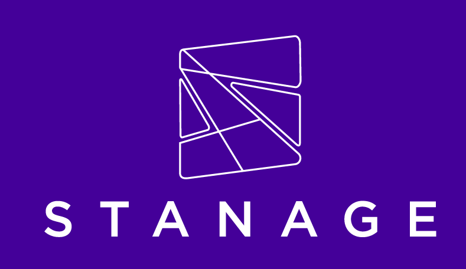

# Run an open-weight LLM on Stanage

[](https://github.com/rcgsheffield/stanage-llm/actions/workflows/shellcheck.yml)
[](https://doi.org/10.15131/shef.data.33102185)

A minimal, copy-paste example for running open-weight large language models
(Llama, Qwen, Mistral, gpt-oss, …) on the University of Sheffield's
**[Stanage](https://docs.hpc.shef.ac.uk/en/latest/stanage/index.html)** HPC
cluster — using [Ollama](https://ollama.com) inside an
[Apptainer](https://docs.hpc.shef.ac.uk/en/latest/stanage/software/apps/apptainer.html) container.

The hard part of doing this isn't the model — it's the HPC mechanics (SLURM,
GPUs, containers, where multi-GB weights are allowed to live). This repo
handles all of that so you can get from *"I have a Stanage account"* to
*"I'm chatting with a model on an A100"* in about five commands.

> [!CAUTION]
> **The HPC service must not be used to store or process any restricted or
> sensitive data.** This is a rule for Stanage and Bessemer as a whole, not
> just for this repo — no configuration of these scripts, or of anything else
> on the clusters, makes sensitive data acceptable here. Keep to
> non-sensitive, non-personal data — see [Security](#security) for the details
> and what to do if you need more.

## Why this approach

- **Ollama** is the simplest way to run a model: one program, it downloads
  quantized models for you, and it serves a local API.
- **Apptainer** is preinstalled on Stanage and needs no root — we *pull* a
  ready-made image, so there is nothing to build or compile.
- **No dependency hell:** the container already contains CUDA, the GPU
  runtime, and Ollama.

## Security

### The cluster-wide rule comes first

Before any question about this repo, there is a rule about the service itself.
From the Stanage/Bessemer
[filestore documentation](https://docs.hpc.shef.ac.uk/en/latest/hpc/filestore.html#shared-project-directories):

> **Danger**
>
> The High Performance Computing service must not be used to store or process
> any restricted or sensitive data. Shared areas with this type of data are not
> permitted to be made available on the clusters.
>
> Research shared storage areas may already contain sensitive data, or may
> contain sensitive data stored by colleagues you are not aware of. Before
> requesting an area to be made available on the HPC clusters, you must ensure
> that they do not and will not contain any sensitive data for the life time of
> the area.

Two things follow from this that people routinely miss:

- **It is not about this repo.** The prohibition applies to the whole HPC
  service. The weaknesses described below (unauthenticated API, plaintext logs)
  are additional reasons to be careful — they are not the reason the rule
  exists, and fixing them would not make sensitive data permissible.
- **It covers data you didn't put there.** If you have a shared project or
  research storage area mounted on the cluster, you are responsible for it
  containing no sensitive data — including anything a colleague might add
  later, for as long as the area exists. "I didn't upload anything sensitive"
  is not sufficient; check with everyone who can write to the area before
  requesting it be made available, and keep checking.

If in doubt, don't mount it and don't process it — ask [Research Computing
Support](https://docs.hpc.shef.ac.uk/en/latest/help.html#gsc.tab=0) first.

### What data is this suitable for?

Only data you would be comfortable with another Stanage user seeing. In
practice that means public, synthetic, or otherwise non-sensitive material:
open datasets, published text, your own draft writing, code you're happy to
share.

**Do not use these scripts for:**

- personal data / anything identifying a living individual (UK GDPR),
- clinical, patient, or participant data,
- commercially confidential or contractually restricted data (e.g. industry
  partner data, data under an NDA or a data sharing agreement),
- anything above *Public* under the University's [Information Classification
  scheme](https://sheffield.ac.uk/library/records-management-policy-and-guidance),
- anything the University's [research data security
  guidance](https://sheffield.ac.uk/library/research-data-management/security)
  says needs controlled handling,
- exam material, unpublished assessments, or HR/staff records.

If you're unsure which bucket your data falls into, classify it against the
Information Classification scheme *before* you run anything through this setup,
not after.

On top of the cluster-wide prohibition, this particular setup has two further
weaknesses, both explained below:

1. **The model API is unauthenticated**, and "localhost" does not mean
   "private to your job" on a shared node.
2. **Prompts and outputs land in plaintext on shared storage** — the server
   log (`$OLLAMA_DIR/server.*.log`) and, for batch jobs, the results file
   (`$OLLAMA_DIR/results.*.jsonl`) both live on fastdata, which has no
   encryption at rest and no backups. Nothing here deletes them for you.

If your work genuinely needs to process restricted data, use a service built
for it rather than adapting this one — the University's [Secure Data
Service](https://students.sheffield.ac.uk/it-services/research/secure-data-service)
is the intended route for sensitive research data. Treat combining that with a
locally-hosted LLM as a separate design problem, and talk to [Research
Computing
Support](https://docs.hpc.shef.ac.uk/en/latest/help.html#gsc.tab=0) and your
faculty's information governance contact **before** running anything. Don't
assume this repo can be made adequate by tweaking a variable.

### Why the API isn't private

> [!WARNING]
> Ollama's API has **no authentication** — anyone who can reach the port can
> use the model and read/write server state. Binding to `127.0.0.1` (the
> default here) only means the API isn't reachable from *other* nodes; it
> does **not** mean it's private to your job:
>
> - Apptainer shares the host's network namespace (no container network
>   isolation), so `127.0.0.1` inside the container is the same loopback
>   interface as the bare-metal node.
> - These example jobs don't request exclusive node allocation, so another
>   user's job can be co-scheduled on the same physical node — and,
>   depending on the cluster's SSH policy, other users may also be able to
>   log into that node directly, whether or not they have a job running on
>   it.
> - Either way, anyone who can reach that node's loopback interface can
>   reach your Ollama server with no credentials required.
>
> Never treat `127.0.0.1` binding as isolation. If you need to understand the
> exact exposure on Stanage, ask [Research Computing
> Support](https://docs.hpc.shef.ac.uk/en/latest/help.html#gsc.tab=0) about
> node exclusivity and the SSH access policy.
>
> `start_ollama.sh` and `00_setup.sh` enforce this: if `OLLAMA_HOST` is
> overridden away from `127.0.0.1`/`localhost`/`::1`, they print a warning and
> refuse to start. Set `OLLAMA_ALLOW_NONLOOPBACK=1` to override at your own
> risk.
>
> `config/env.sh` picks the *port* per job (an OS-assigned free port, rather
> than a fixed one) so two jobs co-scheduled on the same node don't
> accidentally collide. This is collision avoidance only — it does **not**
> change anything above. A co-located user can still find your port with a
> few seconds of loopback port scanning.

## Prerequisites

- A Stanage account (see [getting an account](https://docs.hpc.shef.ac.uk/en/latest/hpc/accounts.html)).
- The ability to log in:
  `ssh $USER@stanage.shef.ac.uk`
  (see [Connecting](https://docs.hpc.shef.ac.uk/en/latest/hpc/connecting.html)).
- That's it. Apptainer is already on every node.

---

## Quick start

### 1. Get the code and configure

On a **login node**:

```bash
git clone git@github.com:rcgsheffield/stanage-llm.git
cd stanage-llm
```

The only file you might edit is [`config/env.sh`](config/env.sh) — mainly to
pick a different model (see [Choosing a model](#choosing-a-model)). Everything
large (the container image, model weights, logs, results) is stored under
`/mnt/parscratch/users/$USER` — Stanage's *fastdata* area — because your home
directory is capped at **50 GB** and fastdata is uncapped, fast, and visible
from the GPU nodes.

### 2. One-time setup (login node)

```bash
bash scripts/00_setup.sh
```

This pulls the Ollama container image (~1 GB) and pre-downloads your model's
weights into fastdata. We do this **on the login node on purpose**: it has
reliable internet, and the files it writes are readable by the GPU nodes — so
your actual GPU job runs completely offline. Re-running is safe; it skips work
already done.

### 3. Grab a GPU

```bash
srun --partition=gpu --qos=gpu --gres=gpu:1 --mem=8G --time=00:30:00 --pty bash
```

This drops you into an [interactive shell](https://docs.hpc.shef.ac.uk/en/latest/hpc/scheduler/index.html#types-of-job) on a [GPU node](https://docs.hpc.shef.ac.uk/en/latest/stanage/GPUComputingStanage.html#gsc.tab=0) with one **A100 (80 GB)**.
For the newer **H100** nodes use `--partition=gpu-h100` instead. Interactive
sessions can run for up to **8 hours**. `--qos=gpu` is required.

`--mem=8G --time=00:30:00` is sized for the tiny default model
(`gemma3:270m`) — enough for a quick smoke test. Bigger requests queue longer
(see [Selecting resources](#selecting-resources) below), so scale `--mem` and
`--time` to the model you're actually running:

```bash
# A 8B-14B model for interactive chat
srun --partition=gpu --qos=gpu --gres=gpu:1 --mem=24G --time=02:00:00 --pty bash

# The largest model in the table below (llama3.3:70b), full working session
srun --partition=gpu --qos=gpu --gres=gpu:1 --mem=82G --time=08:00:00 --pty bash
```

### 4. Start the model and chat

Still in the GPU session, from the repo directory:

```bash
source scripts/start_ollama.sh
chat                              # interactive chat
chat "Explain PCA in two sentences."   # or a one-off prompt
```

`source` (not `bash`) matters — it starts the server in your shell and gives
you the `chat` and `stop_ollama` helpers.

> [!IMPORTANT]
> GPUs on Stanage are a shared, limited, and heavily contended resource — an
> idle interactive session still blocks other researchers' jobs from that GPU
> for your whole walltime, even if you've stopped using it. Don't hold one
> open "just in case" or leave a chat session running unattended without an
> active research purpose; request only the time you need (see [Selecting
> resources](#selecting-resources) below) and stop or exit as soon as you're
> done. See Stanage's [Choosing appropriate
> resources](https://docs.hpc.shef.ac.uk/en/latest/hpc/Choosing-appropriate-resources.html#gsc.tab=0)
> guidance for the general principle.

Forgetting to stop the server (or just walking away) keeps the GPU reserved
for the rest of your walltime. `OLLAMA_IDLE_TIMEOUT` (minutes, default `60`)
auto-quits after that long with no API activity — it stops the server and,
if you're in a SLURM job, cancels it too so the GPU goes back to the
scheduler. This is a safety net, not a substitute for stopping the session
yourself when you're done. Set it to `0` to disable, or override the
duration:

```bash
OLLAMA_IDLE_TIMEOUT=0  source scripts/start_ollama.sh   # disable
OLLAMA_IDLE_TIMEOUT=30 source scripts/start_ollama.sh   # override duration
```

### 5. Finish up

```bash
stop_ollama    # stop the server
exit           # leave the GPU session -> releases the GPU to others
```

---

## Choosing a model

Set `MODEL` before running the setup and start scripts. On a single 80 GB
A100 you have plenty of room:

| `MODEL`           | Size (quantized) | Good for                              | Suggested `--mem` |
| ----------------- | ---------------- | ------------------------------------- | ------------------ |
| `gemma3:270m`     | ~300 MB          | Tiny default, quick smoke test        | 8G                  |
| `llama3.1:8b`     | ~5 GB            | Fast, general chat                    | 16G                 |
| `qwen2.5:14b`     | ~9 GB            | Stronger reasoning, coding            | 24G                 |
| `gpt-oss:20b`     | ~14 GB           | Open-weight, strong general model     | 32G                 |
| `llama3.3:70b`    | ~43 GB           | Highest quality; fits one A100        | 82G                 |

The `--mem` column is a starting point (weights plus headroom for the
runtime), not a measured value — see [Selecting resources](#selecting-resources)
below for how to size `--mem`/`--time` properly once you know your workload.

Override the default without editing any file — set it once and it flows
through every script:

```bash
export MODEL=qwen2.5:14b
bash scripts/00_setup.sh          # downloads that model
# ... then in the GPU session:
source scripts/start_ollama.sh
```

Browse the full catalogue at <https://ollama.com/library>.

### Selecting resources

The `--mem`/`--time` values above are starting points, not a formula — actual
usage depends on your model, prompt lengths, and how long you chat for.
Stanage's [Choosing appropriate resources](https://docs.hpc.shef.ac.uk/en/latest/hpc/Choosing-appropriate-resources.html#gsc.tab=0)
guidance is worth reading before running anything beyond a quick test:

- **Bigger requests queue longer.** `--mem`/`--time` are a reservation, not a
  measurement — the scheduler has to find a slot with *at least* that much
  free before your job can start, so padding "just in case" directly costs
  you wait time on a busy cluster. A request bigger than the cluster can ever
  satisfy will simply never start.
- **Measure, don't guess.** After a job finishes, run `seff <job-id>` to see
  actual memory and time used, and size your next request from that instead
  of copying the defaults in this README.
- **Jobs are killed, not throttled, if they exceed a limit** — request
  comfortably above what `seff` shows, not exactly at it.

---

## Going further

Two optional extras live in [`examples/`](examples/):

### Query the API from Python

Ollama serves an **OpenAI-compatible** API on `http://$OLLAMA_HOST` (the port
is chosen per job — see [Security](#security) above — and printed by
`start_ollama.sh` as `==> Ready. The API is at http://$OLLAMA_HOST`), so your
existing code using the `openai` client works with only a changed `base_url`
(see [Security](#security) above for what that binding does and doesn't
protect against). Inside the GPU session, after `source scripts/start_ollama.sh`:

```bash
python3 examples/query_api.py "Draft a one-line commit message for a bug fix."
```

[`query_api.py`](examples/query_api.py) uses the `openai` client if it is
installed and otherwise falls back to the standard library — so it runs with no
extra installs.

### Batch inference over a dataset (no interaction)

To process a file of prompts unattended, submit the batch job — it requests a
GPU, runs every prompt in [`examples/prompts.jsonl`](examples/prompts.jsonl)
through the model, writes answers to fastdata, and exits. The SLURM output
log itself also lands in `/mnt/parscratch/users/$USER/ollama/` — not the
directory you submitted from — so it stays with the rest of that run's
files:

```bash
sbatch examples/batch_inference.sbatch     # from the repo root, on a login node
squeue --me                                # watch it
```

See [`examples/batch_inference.sbatch`](examples/batch_inference.sbatch) for the
SLURM resource request you'd adapt for larger runs (batch jobs may run up to
96 hours).

---

## Troubleshooting

| Symptom | Fix |
| --- | --- |
| `nvidia-smi` fails / model is very slow | You're not on a GPU or forgot `--nv`. Confirm you started the session with `--gres=gpu:1 --qos=gpu`. |
| `no active SLURM job detected` when sourcing `start_ollama.sh` | You're on a login node. Grab a GPU session first (step 3 above), then source the script from inside it. |
| `apptainer: command not found` | You're probably not on Stanage. It's preinstalled there — no `module load` needed. |
| `image not found` / `command not found` for the model | Run `bash scripts/00_setup.sh` on a login node first. |
| Out-of-memory / CUDA OOM | Use a smaller `MODEL`, or request more with `--mem` / a bigger GPU (`--partition=gpu-h100-nvl` for 94 GB). |
| First response is slow, then fast | Normal — the weights load from Lustre into VRAM on first use. |
| Home quota full | Confirm `OLLAMA_MODELS` points at `/mnt/parscratch/...` (it does by default). Never let Ollama write to `~/.ollama`. |
| Server won't start | Check the log printed at startup: `cat "$OLLAMA_LOG"` (e.g. `/mnt/parscratch/users/$USER/ollama/server.<job-id>.log`). |

---

## How it fits together

```
login node                         GPU node (interactive srun session)
-----------                        -----------------------------------
00_setup.sh                        start_ollama.sh
  apptainer pull ollama.sif  --->    apptainer exec --nv ... ollama serve  (background)
  ollama pull $MODEL         --->    chat  ->  ollama run $MODEL
       |                                          |
       v                                          v
  /mnt/parscratch/users/$USER/ollama   (image + weights, shared by both)
```

## Where your data lives

Stanage has several storage areas with very different rules; this repo only
uses two of them.

| Area | Path | Used for | Notes |
| --- | --- | --- | --- |
| Fastdata | `/mnt/parscratch/users/$USER` | Container image, model weights, server logs, batch job output/results | No quota, no backups. Fast (Lustre) and readable from both login and GPU nodes — the only area both need to see the same files. Not tuned for lots of small files, so don't dump unrelated small-file workloads here. |
| Home | `~` (`/users/$USER`) | This git checkout only | Capped at **50 GB**, not backed up. Everything large is deliberately kept out (see `config/env.sh`) so cloning this repo never risks the quota. |

Neither area is encrypted at rest or backed up, and your prompts and model
outputs are written there in plaintext (`server.*.log`, `results.*.jsonl`) —
another reason not to run sensitive or confidential data through this setup.
See [The cluster-wide rule comes first](#the-cluster-wide-rule-comes-first)
above.

If you bind-mount a shared project directory into a job here, the same rule
applies to that area: it must not contain restricted or sensitive data, now or
at any point while it is available on the cluster.

See [Filestores](https://docs.hpc.shef.ac.uk/en/latest/hpc/filestore.html) for
the full picture, including quotas and backup policy for areas this repo
doesn't touch.

## Citing this repository

Please cite this repository using the metadata in [`CITATION.cff`](CITATION.cff) (GitHub renders a "Cite this repository" button on the repo homepage from this file), or via its DOI: [10.15131/shef.data.33102185](https://doi.org/10.15131/shef.data.33102185).

If this work made use of Stanage, please also acknowledge the HPC service itself, as recommended in the [Stanage citation guidance](https://docs.hpc.shef.ac.uk/en/latest/citing.html#gsc.tab=0):

> We acknowledge IT Services at The University of Sheffield for the provision of services for High Performance Computing.

## Reference documentation

- [Using GPUs on Stanage](https://docs.hpc.shef.ac.uk/en/latest/stanage/GPUComputingStanage.html)
- [Job submission (SLURM)](https://docs.hpc.shef.ac.uk/en/latest/hpc/scheduler/index.html)
- [Apptainer/Singularity on Stanage](https://docs.hpc.shef.ac.uk/en/latest/stanage/software/apps/apptainer.html)
- [Filestores (home / fastdata / scratch)](https://docs.hpc.shef.ac.uk/en/latest/hpc/filestore.html)
- [Shared project directories — including the restricted/sensitive data prohibition](https://docs.hpc.shef.ac.uk/en/latest/hpc/filestore.html#shared-project-directories)
- [Stanage specifications](https://docs.hpc.shef.ac.uk/en/latest/stanage/cluster_specs.html)
- [Information Classification scheme (records management policy and guidance)](https://sheffield.ac.uk/library/records-management-policy-and-guidance)
- [Research data security (University of Sheffield)](https://sheffield.ac.uk/library/research-data-management/security)
- [Secure Data Service — for sensitive research data](https://students.sheffield.ac.uk/it-services/research/secure-data-service)

---



---

## AI Usage Statement

Parts of this repository were written with the assistance of Claude Code, Anthropic's command-line coding agent. AI was used as a tool under human direction, not as an autonomous author. Every change — whether AI-assisted or hand-written — was reviewed, tested, and accepted by a human maintainer before being committed or merged.
